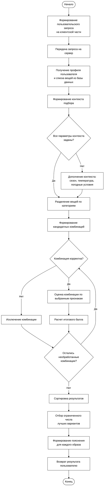

## Рисунок 2.2 — Блок-схема процесса подбора образа

### Краткая подпись для диплома

Блок-схема отражает общий порядок работы проектируемого модуля подбора образов: от получения пользовательского запроса и данных гардероба до формирования допустимых комбинаций, их оценки, ранжирования и возврата пользователю ограниченного набора лучших результатов с пояснением.
