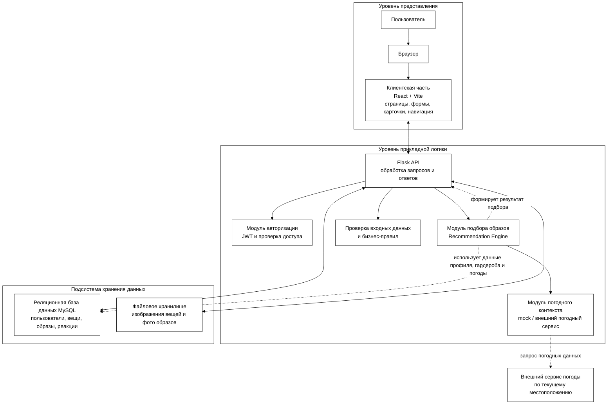

## Рисунок 2.3 — Разделение системы по уровням

### Краткая подпись для диплома

Схема отражает проектируемое разделение веб-сервиса на три уровня. На уровне представления располагается клиентская часть, через которую пользователь взаимодействует с системой. На уровне прикладной логики размещаются API, авторизация, проверка входных данных и модуль подбора образов. На уровне хранения находятся реляционная база данных и файловое хранилище изображений. Внешний сервис погоды рассматривается как отдельный источник данных, который планируется подключить для автоматического определения погодного контекста.

### Если нужна более простая подпись под рисунком

Рисунок 2.3 — Разделение проектируемой системы на уровень представления, уровень прикладной логики и подсистему хранения данных.
