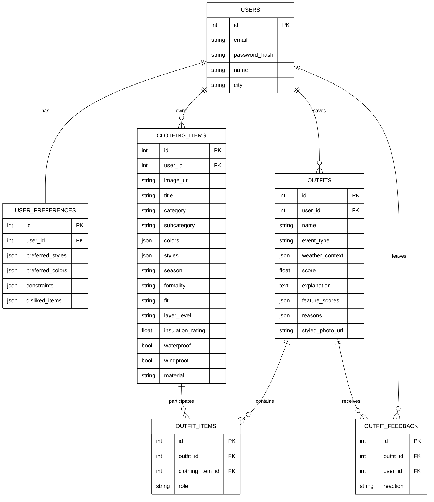

## Рисунок 2.4 — ER-диаграмма проектируемой базы данных

### Подпись к рисунку

На рисунке представлена ER-диаграмма проектируемой базы данных веб-сервиса подбора образов. Диаграмма отражает основные сущности предметной области, их атрибуты, первичные и внешние ключи, а также логические связи между таблицами. В центре модели располагается сущность пользователя, так как именно через нее определяется принадлежность остальных данных системы. Через пользователя связываются предпочтения, элементы цифрового гардероба, сохраненные образы и записи обратной связи. Для представления состава образа используется отдельная промежуточная сущность `OUTFIT_ITEMS`, которая реализует связь между образом и вещами.

### Что важно при переносе схемы в диплом

- для `USERS` и `USER_PREFERENCES` следует показывать связь `1:1`;
- для `USERS` и `CLOTHING_ITEMS` используется связь `1:N`;
- для `USERS` и `OUTFITS` используется связь `1:N`;
- связь между `OUTFITS` и `CLOTHING_ITEMS` реализуется не напрямую, а через `OUTFIT_ITEMS`;
- в `OUTFIT_FEEDBACK` желательно отдельно подписать ограничение уникальности пары `outfit_id + user_id`;
- в `USER_PREFERENCES` желательно отдельно подписать уникальность `user_id`;
- в `USERS` желательно отдельно подписать уникальность `email`.

### Важная корректировка схемы

В таблице `OUTFITS` не следует добавлять поля `outfit_id` или `string_image_item_id`. Для проектируемой модели корректным является набор полей: идентификатор образа, ссылка на пользователя, название, тип события, погодный контекст, итоговая оценка, пояснение, оценки по признакам, причины выбора и путь к фотографии пользователя в образе.
