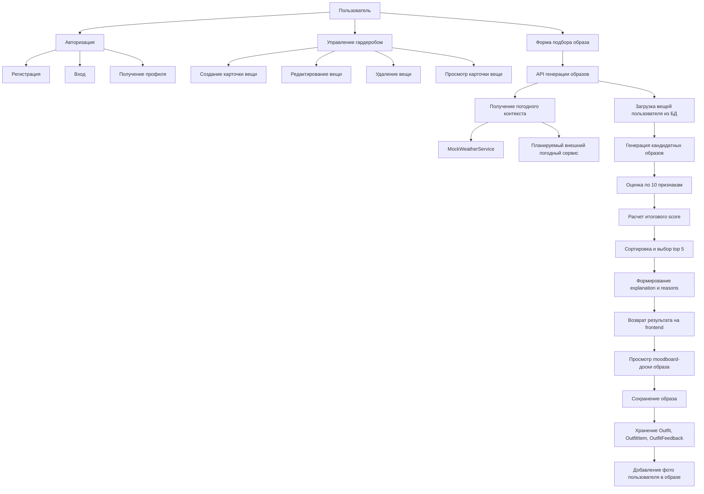
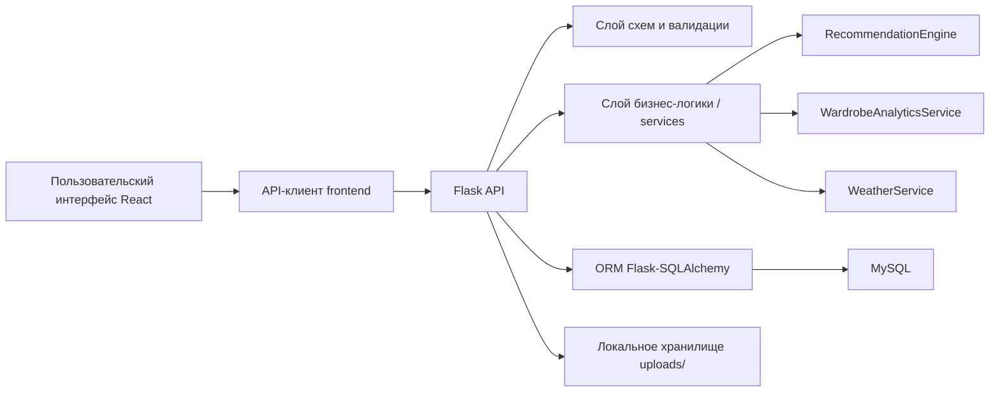
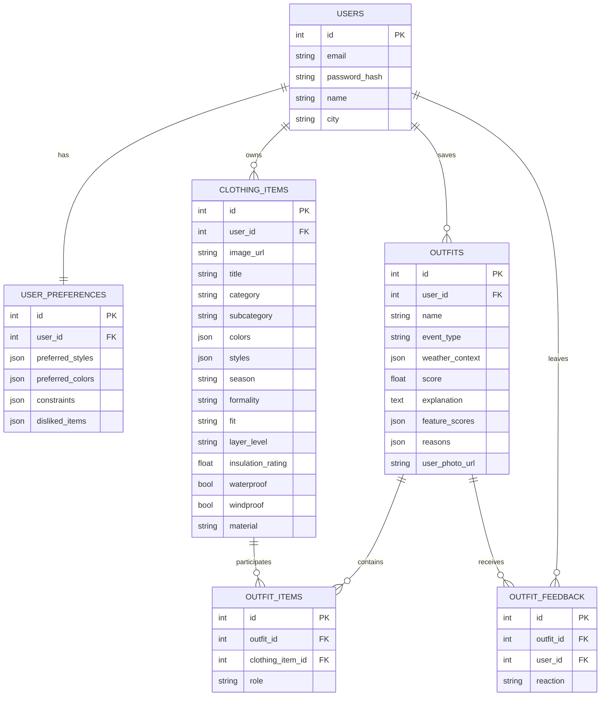
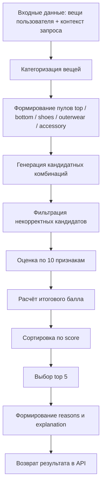
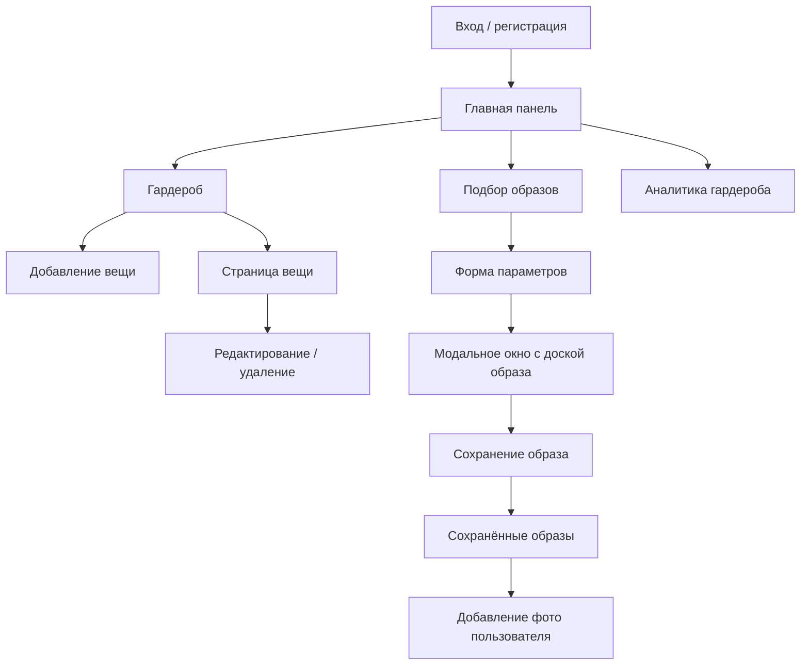

# Проектирование веб-сервиса подбора образов и гардероба

## Назначение документа

Документ описывает текущую реализацию и проектные решения веб-сервиса подбора образов из личного гардероба пользователя. Материал подготовлен как техническая основа для написания второй главы дипломной работы:

- `2.1. Проектирование функциональной схемы веб-сервиса`
- `2.2. Проектирование архитектуры системы`
- `2.3. Проектирование базы данных`
- `2.4. Моделирование алгоритма подбора образов`
- `2.5. Проектирование пользовательского интерфейса`

Документ отражает текущее состояние MVP и одновременно показывает, как система может быть расширена в следующей итерации, в том числе за счет подключения внешних сервисов определения погоды по текущему местоположению пользователя.

---

## 1. Общая идея проекта

Разрабатываемый веб-сервис предназначен для поддержки пользователя при формировании образов из уже имеющихся вещей. Пользователь создает цифровой гардероб, заполняя карточки одежды, после чего задает контекст подбора:

- тип события;
- предпочтительные цвета;
- предпочтительный стиль;
- температуру;
- погодные условия;
- ограничения;
- при необходимости опорную вещь.

После этого система автоматически формирует допустимые сочетания вещей, оценивает каждую комбинацию по набору признаков и возвращает наиболее удачные образы. Важная особенность проекта состоит в том, что подбор строится не на LLM и не на генеративной модели, а на интерпретируемом rule-based алгоритме рекомендаций.

Сервис ориентирован на следующие функции:

- цифровое хранение вещей;
- ручное описание характеристик одежды;
- автоматическую сборку комплектов;
- объяснение, почему образ был выбран;
- сохранение удачных образов;
- базовую аналитику состава гардероба;
- возможность в дальнейшем учитывать фактическую погоду пользователя через внешний API.

---

## 2. Технологический стек

### Backend

- Python
- Flask
- Flask-SQLAlchemy
- Flask-Migrate
- Flask-JWT-Extended
- Flask-CORS
- python-dotenv
- MySQL

### Frontend

- React
- JavaScript
- Vite
- React Router
- Fetch API

### Хранение файлов

- локальная директория `uploads/`

### Принципиальные ограничения проекта

- не используются LLM;
- не используются FastAPI и TypeScript;
- не применяется Docker Compose;
- не выполняется автоматическое распознавание одежды по фото;
- подбор реализуется как набор формальных правил, пригодных для объяснения и поэтапного улучшения.

---

## 3. Актуальная структура проекта

Ниже приведена рабочая структура репозитория в упрощенном виде. В ней отражены только значимые каталоги и файлы проекта, без виртуального окружения и служебных кэшей.

```text
project_wardrobe/
├─ .env
├─ .env.example
├─ .gitignore
├─ README.md
├─ backend/
│  ├─ requirements.txt
│  ├─ run.py
│  ├─ app/
│  │  ├─ __init__.py
│  │  ├─ cli.py
│  │  ├─ api/
│  │  │  ├─ __init__.py
│  │  │  ├─ auth.py
│  │  │  ├─ items.py
│  │  │  ├─ outfits.py
│  │  │  └─ analytics.py
│  │  ├─ config/
│  │  │  ├─ __init__.py
│  │  │  └─ settings.py
│  │  ├─ extensions/
│  │  │  └─ __init__.py
│  │  ├─ models/
│  │  │  ├─ __init__.py
│  │  │  ├─ user.py
│  │  │  ├─ user_preferences.py
│  │  │  ├─ clothing_item.py
│  │  │  ├─ outfit.py
│  │  │  └─ outfit_feedback.py
│  │  ├─ schemas/
│  │  │  ├─ __init__.py
│  │  │  ├─ auth.py
│  │  │  ├─ item.py
│  │  │  └─ outfit.py
│  │  ├─ services/
│  │  │  ├─ __init__.py
│  │  │  ├─ recommendation_engine.py
│  │  │  ├─ analytics_service.py
│  │  │  ├─ weather_service.py
│  │  │  └─ demo_wardrobe_seed.py
│  │  └─ utils/
│  │     ├─ __init__.py
│  │     ├─ auth.py
│  │     ├─ errors.py
│  │     ├─ request.py
│  │     └─ storage.py
│  ├─ migrations/
│  │  ├─ alembic.ini
│  │  ├─ env.py
│  │  └─ versions/
│  │     ├─ e93d24105967_initial_schema.py
│  │     ├─ 8b1f7f3c9c2a_add_item_metadata_fields.py
│  │     └─ b1f4037c1f2a_add_outfit_presentation_fields.py
│  └─ tests/
│     ├─ __init__.py
│     └─ test_recommendation_engine.py
├─ frontend/
│  ├─ package.json
│  ├─ vite.config.js
│  └─ src/
│     ├─ main.jsx
│     ├─ App.jsx
│     ├─ api/
│     │  ├─ client.js
│     │  ├─ authApi.js
│     │  ├─ itemsApi.js
│     │  ├─ outfitsApi.js
│     │  └─ analyticsApi.js
│     ├─ components/
│     │  ├─ Layout.jsx
│     │  ├─ NavBar.jsx
│     │  ├─ ProtectedRoute.jsx
│     │  ├─ GuestRoute.jsx
│     │  ├─ StatCard.jsx
│     │  ├─ ClothingItemForm.jsx
│     │  └─ OutfitCard.jsx
│     ├─ context/
│     │  └─ AuthContext.jsx
│     ├─ hooks/
│     │  └─ useAuth.js
│     ├─ data/
│     │  └─ clothingOptions.js
│     ├─ pages/
│     │  ├─ LoginPage.jsx
│     │  ├─ RegisterPage.jsx
│     │  ├─ DashboardPage.jsx
│     │  ├─ WardrobePage.jsx
│     │  ├─ AddClothingItemPage.jsx
│     │  ├─ EditClothingItemPage.jsx
│     │  ├─ ClothingItemDetailsPage.jsx
│     │  ├─ OutfitGeneratorPage.jsx
│     │  ├─ SavedOutfitsPage.jsx
│     │  └─ AnalyticsPage.jsx
│     ├─ styles/
│     │  └─ global.css
│     └─ utils/
│        └─ i18n.js
├─ uploads/
│  ├─ placeholders/
│  └─ *.jpg / *.png / *.webp
└─ docs/
   └─ project_design_description.md
```

---

## 4. Функциональное назначение основных подсистем

### 4.1. Подсистема авторизации

Назначение:

- регистрация пользователя;
- вход в систему;
- получение профиля текущего пользователя;
- защита приватных маршрутов и API.

Основные элементы:

- backend: `backend/app/api/auth.py`
- frontend: `frontend/src/context/AuthContext.jsx`
- frontend routes: `ProtectedRoute`, `GuestRoute`

### 4.2. Подсистема цифрового гардероба

Назначение:

- хранение карточек вещей;
- просмотр списка вещей;
- создание, редактирование и удаление вещи;
- загрузка изображения вещи;
- просмотр отдельной страницы вещи.

Основные элементы:

- backend: `backend/app/api/items.py`
- frontend: `WardrobePage`, `ClothingItemDetailsPage`, `ClothingItemForm`

### 4.3. Подсистема подбора образов

Назначение:

- прием параметров подбора;
- генерация сочетаний вещей;
- оценка сочетаний по набору признаков;
- сортировка по итоговому баллу;
- возврат top 5 образов;
- объяснение причин выбора.

Основные элементы:

- backend: `backend/app/api/outfits.py`
- backend: `backend/app/services/recommendation_engine.py`
- frontend: `OutfitGeneratorPage`, `OutfitCard`

### 4.4. Подсистема сохранения образов

Назначение:

- сохранение удачного образа в базу;
- просмотр сохраненных образов;
- фиксация обратной связи пользователя;
- возможность прикрепить фото пользователя в выбранном образе.

### 4.5. Подсистема аналитики гардероба

Назначение:

- подсчет количества вещей;
- распределение по категориям;
- распределение по сезонам;
- распределение по стилям;
- формирование простых рекомендаций по улучшению состава гардероба.

---

# 2 СПЕЦИАЛЬНЫЙ РАЗДЕЛ

## 2.1. Проектирование функциональной схемы веб-сервиса

### 2.1.1. Основной пользовательский сценарий

Работа сервиса строится вокруг следующего сценария:

1. Пользователь регистрируется и входит в систему.
2. Пользователь заполняет цифровой гардероб, добавляя карточки вещей.
3. Пользователь открывает форму подбора образа и задает контекст.
4. Сервис получает вещи пользователя из базы данных.
5. Алгоритм подбора формирует допустимые комбинации.
6. Каждая комбинация оценивается по 10 признакам.
7. Комбинации сортируются по итоговому баллу.
8. Пользователь получает top 5 наиболее подходящих образов.
9. Пользователь может сохранить понравившийся образ.
10. Пользователь может открыть сохраненный образ и прикрепить собственное фото.

### 2.1.2. Функциональная схема работы системы



### 2.1.3. Входные и выходные данные подсистем

#### Входные данные модуля гардероба

- название вещи;
- категория;
- подкатегория;
- список цветов;
- список стилей;
- сезон;
- уровень формальности;
- посадка;
- роль вещи в слоистости;
- утепление;
- защита от дождя;
- защита от ветра;
- изображение.

#### Входные данные модуля генерации образов

- `event_type`;
- `preferred_colors`;
- `preferred_style`;
- `temperature`;
- `weather_condition`;
- `anchor_item_id`;
- `constraints`.

#### Выходные данные модуля генерации

- имя образа;
- список вещей;
- общий балл;
- оценки по признакам;
- примененные веса;
- причины выбора;
- текстовое объяснение;
- погодный контекст.

### 2.1.4. Будущая интеграция с погодным сервисом

На текущем этапе используется `MockWeatherService`, который возвращает тестовую погоду по сезону. Однако проектная схема изначально предусматривает включение внешнего погодного сервиса.

Будущий сценарий интеграции:

1. frontend получает геолокацию пользователя через браузерный API;
2. координаты передаются на backend;
3. backend обращается к внешнему weather API;
4. ответ нормализуется к внутреннему формату:
   - `city`
   - `temperature`
   - `weather_condition`
   - `season`
   - `source`
5. recommendation engine использует этот контекст без изменения своей внутренней логики.

Таким образом, слой алгоритма уже отделен от источника погодных данных. Это позволяет заменить mock-источник на внешний API без переработки всего модуля подбора.

---

## 2.2. Проектирование архитектуры системы

### 2.2.1. Архитектурный подход

Система реализована как двухуровневое веб-приложение:

- клиентская часть на React;
- серверная часть на Flask;
- общая база данных MySQL;
- локальное файловое хранилище изображений;
- расширяемый слой сервисов для рекомендаций, аналитики и погоды.

По характеру взаимодействия проект близок к трехслойной архитектуре:

- слой представления: React UI;
- слой прикладной логики: Flask API и сервисы;
- слой хранения данных: MySQL и локальные изображения.

### 2.2.2. Архитектурная схема системы



### 2.2.3. Архитектура backend

Backend построен на `app factory pattern`.

#### Центральная точка инициализации

Файл `backend/app/__init__.py` выполняет:

- создание Flask-приложения;
- загрузку конфигурации;
- инициализацию CORS;
- инициализацию расширений;
- регистрацию blueprints;
- регистрацию CLI-команд;
- регистрацию обработчиков ошибок;
- публикацию health-check и статических файлов uploads.

#### Конфигурационный слой

Файл `backend/app/config/settings.py` отвечает за:

- чтение `.env`;
- построение `SQLALCHEMY_DATABASE_URI`;
- настройку JWT;
- ограничение размера загружаемых файлов;
- настройку `UPLOAD_FOLDER`;
- настройку `FRONTEND_URL` для CORS.

#### Слой расширений

Файл `backend/app/extensions/__init__.py` инициализирует:

- `db = SQLAlchemy()`;
- `migrate = Migrate()`;
- `jwt = JWTManager()`.

#### Слой API

BluePrint-модули:

- `auth.py`
- `items.py`
- `outfits.py`
- `analytics.py`

Именно этот слой принимает HTTP-запрос, вызывает валидацию и передает управление в бизнес-логику.

#### Слой схем

Модули `schemas` не используют полноценный marshmallow, но выполняют роль простых валидаторов входных данных:

- `auth.py` — login/register;
- `item.py` — создание и редактирование вещи;
- `outfit.py` — генерация, сохранение, feedback.

#### Слой сервисов

Сервисы выделены отдельно, чтобы бизнес-логика не смешивалась с HTTP-кодом:

- `recommendation_engine.py`
- `analytics_service.py`
- `weather_service.py`
- `demo_wardrobe_seed.py`

#### Слой утилит

- `auth.py` — получение текущего пользователя по JWT;
- `request.py` — чтение JSON и form-data;
- `storage.py` — сохранение и удаление изображений;
- `errors.py` — единая модель API-ошибки.

### 2.2.4. Архитектура frontend

Frontend разделен на несколько логических частей.

#### Роутинг

`frontend/src/App.jsx` определяет маршруты:

- `/login`
- `/register`
- `/`
- `/wardrobe`
- `/wardrobe/add`
- `/wardrobe/:itemId`
- `/wardrobe/:itemId/edit`
- `/generate`
- `/outfits`
- `/analytics`

#### Контекст аутентификации

`AuthContext.jsx` хранит:

- `token`;
- `user`;
- `loading`;
- методы `login`, `register`, `logout`, `refreshProfile`.

Токен хранится в `localStorage`, после чего frontend запрашивает профиль через `/api/auth/me`.

#### API-клиент

`frontend/src/api/client.js` обеспечивает:

- централизованный вызов `fetch`;
- автоматическое добавление JWT;
- обработку JSON-ответа;
- выброс ошибок;
- нормализацию ссылок на изображения.

#### Компонентный слой

- `Layout.jsx` — общий каркас экрана;
- `NavBar.jsx` — навигация;
- `ClothingItemForm.jsx` — форма вещи;
- `OutfitCard.jsx` — просмотр образа в модальном окне как доски;
- `StatCard.jsx` — карточки статистики.

### 2.2.5. Архитектурные преимущества выбранного решения

Преимущества текущей архитектуры:

- простота сопровождения одним разработчиком;
- четкое разделение API, моделей и сервисов;
- возможность локально запускать и тестировать проект без контейнеризации;
- подготовленность к расширению алгоритма;
- подготовленность к будущему подключению внешнего weather API;
- наличие отдельного UI-слоя для постепенного развития интерфейса.

---

## 2.3. Проектирование базы данных

### 2.3.1. Общий подход к моделированию данных

База данных MySQL хранит:

- пользователей;
- предпочтения пользователей;
- одежду;
- сохраненные образы;
- состав образов;
- реакции пользователя на образы.

Для некоторых полей выбраны JSON-колонки. Это позволяет гибко хранить списки цветов, стилей и ограничений без создания множества промежуточных таблиц в MVP-версии.

### 2.3.2. Описание сущностей

#### Таблица `users`

Назначение:

- хранение учетной записи пользователя.

Поля:

- `id` — первичный ключ;
- `email` — уникальный email;
- `password_hash` — хеш пароля;
- `name` — имя пользователя;
- `city` — город пользователя.

#### Таблица `user_preferences`

Назначение:

- хранение предпочтений пользователя.

Поля:

- `id`;
- `user_id` — внешний ключ на `users`;
- `preferred_styles` — JSON-массив стилей;
- `preferred_colors` — JSON-массив цветов;
- `constraints` — JSON-массив ограничений;
- `disliked_items` — JSON-массив нежелательных характеристик.

Связь:

- `users 1:1 user_preferences`

#### Таблица `clothing_items`

Назначение:

- хранение карточек вещей пользователя.

Поля:

- `id`;
- `user_id`;
- `image_url`;
- `title`;
- `category`;
- `subcategory`;
- `colors` — JSON;
- `styles` — JSON;
- `season`;
- `formality`;
- `fit`;
- `layer_level`;
- `insulation_rating`;
- `waterproof`;
- `windproof`;
- `material`.

Замечание:

Поле `material` присутствует на уровне модели и БД, однако в текущем пользовательском интерфейсе его заполнение скрыто. Оно может использоваться как резерв для будущего расширения анализа фактур и сезонности.

#### Таблица `outfits`

Назначение:

- хранение сохраненных образов.

Поля:

- `id`;
- `user_id`;
- `name`;
- `event_type`;
- `weather_context` — JSON;
- `score`;
- `explanation`;
- `feature_scores` — JSON;
- `reasons` — JSON;
- `styled_photo_url` — в БД хранится в колонке `user_photo_url` для совместимости миграций.

#### Таблица `outfit_items`

Назначение:

- связывает образ с вещами и фиксирует роль вещи в образе.

Поля:

- `id`;
- `outfit_id`;
- `clothing_item_id`;
- `role`.

Связь:

- `outfits 1:N outfit_items`
- `clothing_items 1:N outfit_items`

#### Таблица `outfit_feedback`

Назначение:

- хранит реакцию пользователя на сохраненный образ.

Поля:

- `id`;
- `outfit_id`;
- `user_id`;
- `reaction`.

Дополнительное ограничение:

- уникальность пары `(outfit_id, user_id)` предотвращает дублирование реакции одного пользователя для одного образа.

### 2.3.3. Схема связей базы данных



### 2.3.4. Причины выбора такой схемы БД

Выбранная схема является компромиссом между гибкостью и простотой:

- структура достаточно нормализована для работы с пользователями, вещами и образами;
- списковые характеристики хранятся в JSON для ускорения разработки MVP;
- таблица `outfit_items` позволяет один и тот же предмет использовать в разных сохраненных образах;
- таблица `user_preferences` готовит основу для персонализации рекомендаций;
- таблица `outfit_feedback` создает базу для будущего улучшения алгоритма на основе пользовательских реакций.

---

## 2.4. Моделирование алгоритма подбора образов

### 2.4.1. Назначение алгоритма

Алгоритм подбора образов реализован в `backend/app/services/recommendation_engine.py`.

Его задача:

1. получить все вещи текущего пользователя;
2. выделить допустимые наборы ролей;
3. построить кандидатные сочетания;
4. отфильтровать некорректные варианты;
5. оценить каждую комбинацию по набору признаков;
6. вычислить итоговый score;
7. сформировать объяснение;
8. вернуть top 5 вариантов.

Алгоритм rule-based и полностью интерпретируем.

### 2.4.2. Формирование кандидатных образов

На этапе генерации кандидатов выполняются следующие шаги:

1. Все вещи разбиваются по категориям:
   - `top`
   - `bottom`
   - `shoes`
   - `outerwear`
   - `accessory`
2. Если указана опорная вещь, она должна принадлежать текущему пользователю.
3. Формируются основные пулы вещей.
4. Обязательная основа образа:
   - `top + bottom + shoes`
5. Дополнительные роли:
   - `outerwear`
   - `accessory`
6. Для генерации используется перебор через `itertools.product`.
7. Кандидаты проходят фильтрацию:
   - исключаются дубли одной и той же вещи в одном образе;
   - проверяются обязательные категории;
   - проверяются hard constraints;
   - проверяются event hard rules;
   - проверяется грубая уместность обуви по температуре и погоде;
   - при необходимости учитывается обязательность верхней одежды.

### 2.4.3. Состав признаков оценки

Каждый образ оценивается по 10 признакам.

#### 1. `color_harmony`

Оценивает:

- наличие нейтральной базы;
- цветовую схему;
- цветовую сложность;
- соответствие предпочтительным цветам;
- мягкую уместность обуви и аксессуаров;
- баланс акцентов.

Система поддерживает:

- monochrome;
- analogous;
- complementary;
- neutral + accent.

Также выполняется:

- нормализация цветовых названий;
- сведение цветов к семействам;
- мягкая обработка неизвестных цветов.

#### 2. `style_match`

Оценивает:

- совместимость стилевых семейств вещей;
- доминирующий стиль;
- близость к предпочтительному стилю пользователя.

#### 3. `event_match`

Оценивает:

- соответствие образа событию;
- соответствие формальности;
- отсутствие явных запретных категорий для выбранного события.

#### 4. `season_match`

Оценивает:

- совпадение сезонов вещей с целевым сезоном;
- внутреннюю согласованность сезона набора;
- согласованность уровня утепления.

#### 5. `temperature_match`

Оценивает:

- достаточность утепления;
- соответствие обуви температуре;
- правильность слоев;
- наличие верхней одежды при необходимости.

#### 6. `weather_condition_match`

Оценивает:

- защиту от дождя, снега и ветра;
- уместность обуви в погодных условиях;
- уместность низа;
- наличие защищающего верхнего слоя.

#### 7. `completeness`

Проверяет:

- наличие верха;
- наличие низа;
- наличие обуви;
- при необходимости наличие верхней одежды;
- для некоторых событий желательность аксессуара.

#### 8. `layering_correctness`

Проверяет:

- логичность слоев;
- отсутствие конфликтующих ролей;
- достаточность покрытия слоями;
- фактурный контраст;
- баланс силуэта.

#### 9. `user_preference_match`

Учитывает:

- предпочтительные цвета;
- предпочтительные стили;
- ограничения, заданные в профиле и в запросе.

#### 10. `constraints_match`

Оценивает соблюдение ограничений:

- `no_heels`
- `no_skirts`
- `no_bright_colors`
- пользовательские ограничения
- нежелательные характеристики из `disliked_items`

### 2.4.4. Весовая модель

Базовые веса признаков:

- `color_harmony` — 0.15
- `style_match` — 0.15
- `event_match` — 0.15
- `season_match` — 0.10
- `temperature_match` — 0.10
- `weather_condition_match` — 0.10
- `layering_correctness` — 0.08
- `completeness` — 0.06
- `user_preference_match` — 0.06
- `constraints_match` — 0.05

Дополнительно движок использует контекстные веса: в зависимости от температуры и погоды значимость погодных факторов может увеличиваться.

Итоговый балл:

\[
Score = \sum_{i=1}^{10}(Feature_i \cdot Weight_i)
\]

Все частные оценки находятся в диапазоне `0..1`, итоговый балл также ограничивается диапазоном `0..1`.

### 2.4.5. Формирование объяснения

После расчета всех признаков система:

1. сортирует признаки по убыванию;
2. выбирает 2–4 наиболее сильных;
3. сопоставляет им шаблонные формулировки;
4. собирает:
   - `reasons` — список коротких причин;
   - `explanation` — сводное текстовое описание.

Такой подход обеспечивает explainability без применения генеративных языковых моделей.

### 2.4.6. Логическая схема алгоритма



### 2.4.7. Обработка граничных случаев

Система проектировалась так, чтобы не давать ошибку 500 при типичных проблемных сценариях.

Предусмотрены случаи:

- у пользователя нет вещей;
- отсутствует одна из обязательных категорий;
- опорная вещь не принадлежит пользователю;
- пустые `preferred_colors` или `constraints`;
- часть вещей не содержит цветов или стилей;
- часть цветов неизвестна;
- невозможно собрать допустимую комбинацию.

В этих случаях backend возвращает:

- пустой список образов;
- погодный контекст;
- понятное текстовое сообщение.

### 2.4.8. Перспектива развития алгоритма

Следующие этапы развития без смены базовой архитектуры:

- подключение реального weather API;
- использование геолокации пользователя;
- более детальное моделирование дресс-кодов;
- поддержка принтов и фактур как отдельных признаков;
- более тонкий учет исторической обратной связи;
- персонализация весов на основе сохраненных и отвергнутых образов.

---

## 2.5. Проектирование пользовательского интерфейса

### 2.5.1. Основные страницы системы

#### `LoginPage`

Назначение:

- вход по email и паролю.

#### `RegisterPage`

Назначение:

- регистрация нового пользователя.

#### `DashboardPage`

Назначение:

- общая сводка по гардеробу;
- быстрые действия;
- рекомендации по составу гардероба.

#### `WardrobePage`

Назначение:

- просмотр всех вещей;
- переход к странице вещи;
- быстрые действия редактирования и удаления.

Карточка вещи в списке гардероба отображает:

- фото;
- название;
- иконку редактирования;
- иконку удаления.

#### `AddClothingItemPage`

Назначение:

- создание новой вещи через форму.

#### `EditClothingItemPage`

Назначение:

- изменение параметров существующей вещи.

#### `ClothingItemDetailsPage`

Назначение:

- отдельная карточка вещи;
- вывод всех характеристик;
- действия редактирования и удаления;
- удобный формат для анализа конкретного предмета гардероба.

#### `OutfitGeneratorPage`

Назначение:

- ввод параметров подбора;
- запуск генерации;
- просмотр образов в модальном окне в виде доски.

#### `SavedOutfitsPage`

Назначение:

- просмотр сохраненных образов;
- перелистывание досок образов;
- загрузка фото пользователя в сохраненный образ.

#### `AnalyticsPage`

Назначение:

- отображение агрегированной статистики и рекомендаций.

### 2.5.2. Логика проектирования интерфейса

При проектировании интерфейса использованы следующие принципы:

- интерфейс должен быть понятным для пользователя без специальной подготовки;
- ключевые действия должны быть доступны с минимальным числом кликов;
- карточка вещи должна отображать только необходимый минимум;
- подробности вещи вынесены в отдельную страницу;
- результат подбора образов должен восприниматься визуально, а не только как текст;
- объяснение образа должно быть читаемым и кратким.

### 2.5.3. Форма ввода вещи

Форма `ClothingItemForm` реализует каталогизированный ввод характеристик:

- категория через выпадающий список;
- подкатегория через зависимый список;
- цвета через визуальные swatches;
- стили через множественный выбор;
- сезон, формальность, посадка, слой и утепление через списки;
- дождь и ветер через чекбоксы;
- изображение через upload.

Такое решение снижает число пользовательских ошибок и обеспечивает однородность данных для recommendation engine.

### 2.5.4. Интерфейс подбора образов

Результат генерации отображается как moodboard-доска:

- карточки вещей раскладываются по фиксированной композиции;
- вещь внутри образа кликабельна и ведет на страницу соответствующего предмета;
- справа отображается текстовый разбор образа;
- доступны действия:
  - сохранение;
  - закрытие;
  - перелистывание;
  - загрузка фото пользователя в сохраненный образ.

### 2.5.5. Схема интерфейсного взаимодействия



### 2.5.6. Подготовка интерфейса к будущей погодной интеграции

Интерфейс уже допускает два режима:

- пользователь вручную задает погоду;
- frontend получает погоду автоматически через интеграцию с внешним сервисом.

Для следующего этапа развития можно добавить:

- кнопку "Определить погоду автоматически";
- использование геопозиции браузера;
- блок подтверждения автоматически полученных погодных параметров;
- индикацию источника погодных данных.

---

## Выводы

В результате проектирования создана целостная модель веб-сервиса подбора образов, включающая backend, frontend, базу данных, алгоритм рекомендаций и пользовательский интерфейс.

Ключевые результаты проектирования:

- выбрана простая и расширяемая архитектура на Flask и React;
- сформирована модель данных, покрывающая пользователей, гардероб, предпочтения, сохраненные образы и обратную связь;
- реализован интерпретируемый алгоритм подбора образов по 10 признакам;
- предусмотрена explainability без использования LLM;
- интерфейс ориентирован на ручное наполнение гардероба и визуальный просмотр образов;
- система уже подготовлена к дальнейшему подключению внешнего погодного API по текущему местоположению пользователя.

С точки зрения дипломного проектирования данная структура является достаточной базой для написания второй главы. Она позволяет обосновать:

- функциональную схему работы сервиса;
- архитектурные решения;
- структуру базы данных;
- модель алгоритма рекомендаций;
- принципы построения пользовательского интерфейса.

В следующем этапе на основе данного документа можно формировать академический текст раздела 2 с рисунками, таблицами и аналитическими выводами по каждому подпункту.
