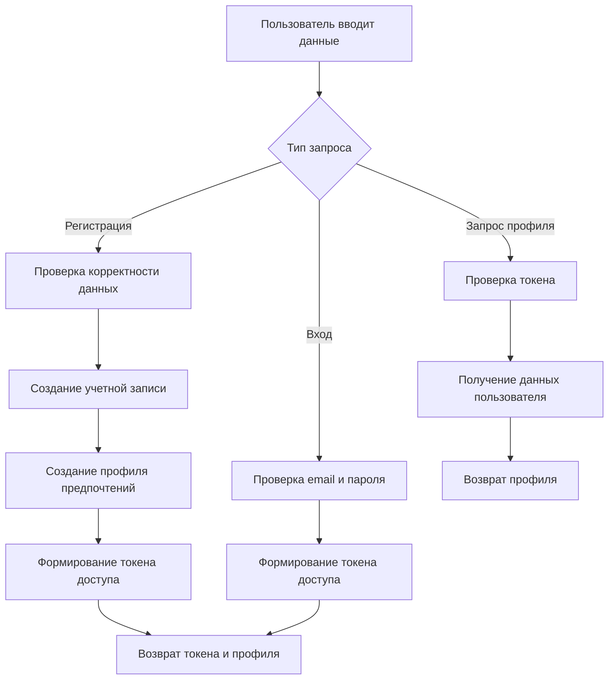
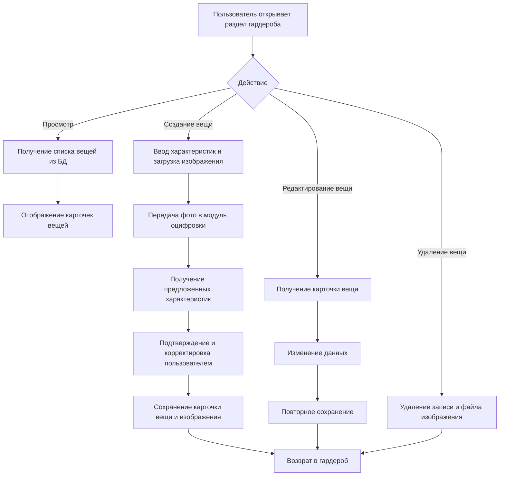
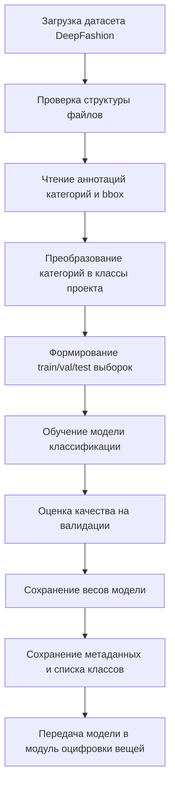
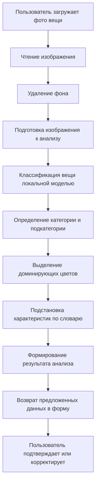
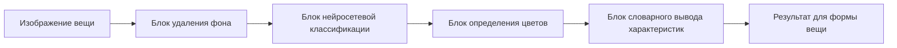
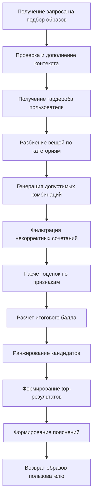
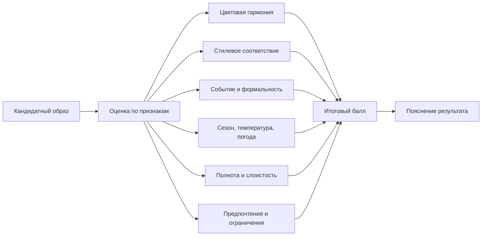
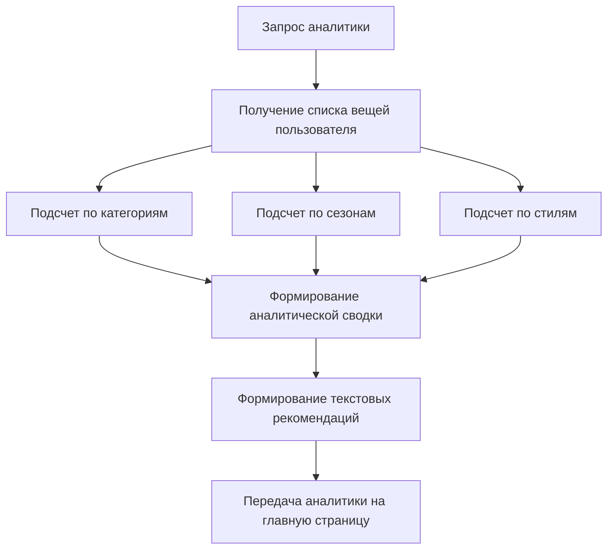
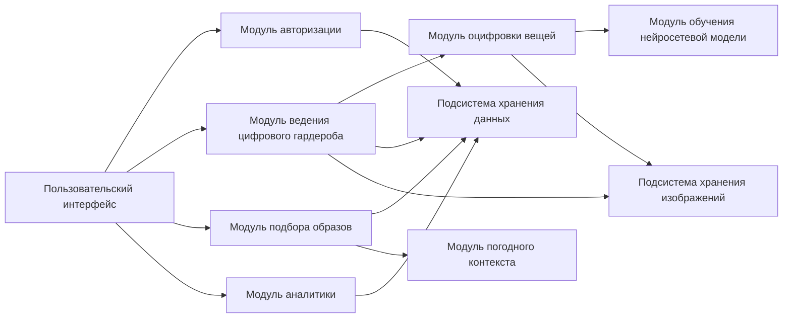

# 2.2. Модуль авторизации

Модуль авторизации предназначен для регистрации пользователя, входа в систему, хранения сведений профиля и разграничения доступа к данным веб-сервиса. В проектируемой системе через данный модуль планируется обеспечивать доступ только к собственному гардеробу, сохранённым образам, аналитике и пользовательским настройкам. Модуль должен работать с данными учётной записи, формировать токен доступа и передавать сведения о текущем пользователе в остальные серверные компоненты.

На вход модуля будут поступать регистрационные данные, учётные данные для входа и запросы на получение текущего профиля. На выходе модуль должен возвращать подтверждение успешной регистрации или авторизации, токен доступа и краткие сведения о пользователе. Данные профиля затем используются модулем цифрового гардероба, модулем подбора образов и модулем аналитики.

В состав модуля авторизации целесообразно включить:
- подсистему регистрации нового пользователя;
- подсистему проверки учётных данных;
- подсистему генерации токена доступа;
- подсистему получения текущего профиля пользователя;
- подсистему инициализации пользовательских предпочтений.

Модуль взаимодействует с:
- пользовательским интерфейсом;
- модулем хранения данных;
- модулем подбора образов;
- модулем ведения цифрового гардероба;
- модулем аналитики.

# 2.3. Модуль ведения цифрового гардероба

Модуль ведения цифрового гардероба предназначен для хранения и управления карточками вещей пользователя. Через этот модуль пользователь должен иметь возможность добавлять новые предметы одежды, просматривать список вещей, открывать карточку отдельной вещи, редактировать её характеристики и удалять ошибочные записи. Данный модуль формирует основной массив входных данных для подбора образов и аналитики гардероба.

В составе карточки вещи предполагается хранить следующие характеристики:
- название вещи;
- категория;
- подкатегория;
- цвета;
- стили;
- сезон;
- уровень формальности;
- посадка;
- уровень слоя;
- утепление;
- защита от дождя;
- защита от ветра;
- изображение вещи.

Модуль должен обеспечивать не только сохранение карточки вещи, но и согласованную работу с интеллектуальной оцифровкой изображения. При добавлении или редактировании записи он будет получать результат анализа фотографии и использовать его для предварительного заполнения атрибутов вещи. После подтверждения пользователем данные будут сохраняться в базе данных, а изображение — в файловом хранилище.

На вход модуля будут поступать данные формы и изображения вещей. На выходе модуль должен возвращать сохранённые карточки, список вещей текущего пользователя и полное описание выбранной записи.

Модуль взаимодействует с:
- пользовательским интерфейсом;
- модулем интеллектуальной оцифровки вещей;
- модулем хранения изображений;
- модулем хранения данных;
- модулем аналитики;
- модулем подбора образов.

# 2.4. Модуль обучения нейросетевой модели

Модуль обучения нейросетевой модели предназначен для подготовки локального классификатора одежды, который затем будет использоваться в модуле интеллектуальной оцифровки вещей. В проектируемой системе предполагается использовать набор данных DeepFashion Category and Attribute Prediction Benchmark. На основе изображений и аннотаций датасета модель должна обучаться распознавать тип вещи по фотографии и выдавать наиболее вероятную подкатегорию предмета одежды.

Данный модуль не будет участвовать в каждом пользовательском запросе. Его задача состоит в предварительной подготовке обученной модели и связанных с ней метаданных. После завершения обучения модуль должен сохранять контрольную точку модели, список классов, сведения об архитектуре и точности на валидационной выборке. Эти данные затем должны передаваться в модуль интеллектуальной оцифровки вещей.

Входными данными для модуля обучения являются:
- изображения из датасета DeepFashion;
- аннотации категорий;
- аннотации ограничивающих прямоугольников;
- разбиение на обучающую, валидационную и тестовую выборки;
- внутреннее соответствие между категориями датасета и подкатегориями проекта.

На выходе модуль должен формировать:
- обученную локальную модель;
- метаданные классификатора;
- набор поддерживаемых классов;
- показатели качества модели.

В составе модуля целесообразно выделить:
- подсистему загрузки и проверки датасета;
- подсистему преобразования аннотаций;
- подсистему подготовки обучающей выборки;
- подсистему обучения модели;
- подсистему сохранения результатов обучения.

Модуль взаимодействует с:
- хранилищем датасета DeepFashion;
- модулем интеллектуальной оцифровки вещей;
- файловой подсистемой хранения артефактов модели.

# 2.5. Модуль оцифровки вещей

Модуль оцифровки вещей является ключевым интеллектуальным модулем веб-сервиса. Его назначение состоит в автоматизации заполнения карточки вещи на основе загруженной фотографии. Пользователь должен загружать изображение предмета одежды, а система — выполнять предварительную обработку изображения, распознавать тип вещи, определять основные цвета и предлагать значения ряда характеристик. Затем пользователь сможет проверить результат и при необходимости скорректировать его вручную.

В проектируемой системе модуль должен использовать несколько последовательно выполняемых этапов:
- чтение загруженного изображения;
- удаление фона;
- подготовка изображения к классификации;
- распознавание подкатегории вещи локальной нейросетевой моделью;
- определение доминирующих цветов;
- вывод дополнительных характеристик по словарю соответствий;
- возврат результатов в форму добавления или редактирования вещи.

После загрузки фотографии модуль должен обращаться к алгоритму удаления фона. Затем очищенное изображение будет передаваться в локальный классификатор, обученный на датасете DeepFashion. Полученная подкатегория должна приводиться к внутренней системе категорий проекта. Далее предполагается вычислять 1–3 доминирующих цвета вещи. На основании распознанной подкатегории и цветового профиля система должна предлагать дополнительные характеристики, в том числе сезон, формальность, посадку, уровень слоя, степень утепления, а также признаки защиты от дождя и ветра.

Важной особенностью данного модуля является сочетание интеллектуальных и алгоритмических методов. Нейросетевая модель используется для определения типа вещи, алгоритм удаления фона — для предварительной обработки изображения, а словарь соответствий — для вывода части характеристик, которые проще и надёжнее определять по типу вещи, чем напрямую по изображению.

Входными данными модуля являются:
- изображение вещи;
- внутренний список категорий и подкатегорий проекта;
- обученная нейросетевая модель;
- словари правил для подстановки характеристик.

На выходе модуль должен возвращать:
- изображение без фона;
- предполагаемую категорию;
- предполагаемую подкатегорию;
- список основных цветов;
- предложенные характеристики карточки вещи;
- уровень уверенности классификатора.

Модуль взаимодействует с:
- модулем ведения цифрового гардероба;
- модулем обучения нейросетевой модели;
- модулем хранения изображений;
- пользовательским интерфейсом.

Для данного модуля целесообразно дополнительно показать внутреннюю блок-схему обработки:

# 2.6. Модуль подбора образов

Модуль подбора образов является центральным вычислительным модулем системы. Его задача состоит в формировании допустимых комплектов одежды из цифрового гардероба пользователя, оценке этих комплектов по нескольким признакам и возврате лучших вариантов с пояснением. Работа модуля будет строиться на основе уже оцифрованных карточек вещей, пользовательских предпочтений, контекста события и погодных условий.

В составе модуля предполагается выделить несколько функциональных этапов:
- получение входных параметров запроса;
- формирование погодного контекста;
- выбор набора вещей пользователя;
- генерация допустимых комбинаций;
- фильтрация некорректных сочетаний;
- вычисление частных оценок;
- расчёт итогового балла;
- ранжирование результатов;
- формирование пояснений;
- возврат пользователю лучших образов.

## 2.6.1. Постановка задачи подбора образов

Задача модуля состоит в том, чтобы на основе имеющихся у пользователя вещей сформировать несколько вариантов образов, соответствующих заданному событию, температуре, погоде и пользовательским ограничениям. Для каждого кандидата необходимо оценить эстетическую и практическую уместность, после чего отсортировать результаты и вернуть верхнюю часть ранжированного списка.

## 2.6.2. Входные данные и контекст генерации

На вход модуля будут поступать:
- список вещей пользователя;
- тип события;
- предпочтительные цвета;
- предпочтительный стиль;
- температурный контекст;
- погодные условия;
- ограничения;
- опорная вещь;
- пользовательские предпочтения из профиля.

Если пользователь не укажет температуру или погодные условия, модуль должен обратиться к модулю погодного контекста и дополнить недостающие параметры автоматически.

## 2.6.3. Проектирование этапов алгоритма

Алгоритм подбора должен работать последовательно. Сначала выполняется разбиение вещей по категориям: верх, низ, обувь, верхняя одежда и аксессуары. Затем формируются допустимые комбинации по заранее заданным шаблонам. После этого исключаются некорректные варианты, например комплекты без обязательных категорий, комплекты с неподходящей обувью по погоде, комплекты с нарушением пользовательских ограничений или комбинации с конфликтом ролей. Далее для каждого кандидата рассчитываются оценки по набору признаков. После вычисления итогового балла варианты сортируются и сокращаются до ограниченного числа лучших комплектов.

## 2.6.4. Система оценочных признаков

Для оценки кандидатов предполагается использовать многокритериальную схему. Каждый образ должен получать частные оценки по следующим признакам:
- цветовая гармония;
- совместимость стиля;
- соответствие типу события;
- соответствие сезону;
- соответствие температуре;
- соответствие погодным условиям;
- полнота комплекта;
- корректность слоёв;
- соответствие предпочтениям пользователя;
- соблюдение ограничений.

Такая система позволяет оценивать образ одновременно с эстетической и функциональной стороны.

## 2.6.5. Весовая модель и расчет итоговой оценки

После вычисления частных оценок модуль должен объединять их в одну итоговую оценку. Для этого предполагается использовать взвешенную сумму признаков. Более высокий вес целесообразно назначать признакам, связанным с погодой, температурой, стилевой уместностью и цветовой гармонией. Итоговый балл будет использоваться для ранжирования кандидатов и выбора лучших вариантов для вывода пользователю.

## 2.6.6. Формирование итогового результата и пояснения

Для каждого итогового варианта модуль должен возвращать:
- состав образа;
- итоговую оценку;
- частные оценки по признакам;
- краткий список причин;
- текстовое пояснение, почему образ оказался среди лучших.

Пояснение должно строиться не нейросетью, а на основе шаблонов и наиболее сильных признаков текущего образа. Это позволит сохранить прозрачность работы системы и сделать результат понятным для пользователя.

## 2.6.7. Обработка граничных случаев

Модуль должен учитывать ситуации, в которых данных пользователя недостаточно или запрос составлен неполно. К таким случаям относятся:
- слишком малое количество вещей в гардеробе;
- отсутствие одной из обязательных категорий;
- неподходящая опорная вещь;
- отсутствие погодных параметров;
- отсутствие части характеристик у отдельных вещей.

В этих случаях система должна не завершаться ошибкой, а возвращать пустой список результатов или поясняющее сообщение.

## 2.6.8. Перспективы развития алгоритма

Дальнейшее развитие модуля может быть связано с:
- расширением набора признаков;
- использованием пользовательской истории выбора;
- персонализацией весов;
- более точным учётом материалов, фактур и силуэта;
- переходом от простых погодных сценариев к данным внешнего погодного сервиса в реальном времени.

Общая блок-схема модуля:

Внутренняя блок-схема оценивания кандидата:

# 2.7. Модуль аналитики

Модуль аналитики предназначен для построения сводной информации по текущему гардеробу пользователя. Его задача состоит в агрегировании данных о вещах и формировании кратких рекомендаций по составу гардероба. Модуль не участвует непосредственно в подборе образов, но повышает информативность системы и помогает пользователю увидеть дисбаланс по категориям, сезонам и стилям.

Входными данными модуля является набор вещей пользователя, сохранённый в базе данных. На основе этих данных система должна вычислять:
- общее количество вещей;
- распределение по категориям;
- распределение по сезонам;
- распределение по стилям;
- текстовые рекомендации по улучшению состава гардероба.

В составе модуля аналитики можно выделить:
- подсистему сбора данных о вещах;
- подсистему расчёта агрегированных показателей;
- подсистему формирования рекомендаций;
- подсистему передачи итоговой сводки на главную страницу.

Модуль взаимодействует с:
- модулем ведения цифрового гардероба;
- модулем хранения данных;
- пользовательским интерфейсом.

# Итоговая схема взаимодействия модулей 2.2-2.7

Для общего рисунка во второй главе можно также использовать укрупнённую схему взаимодействия модулей:

