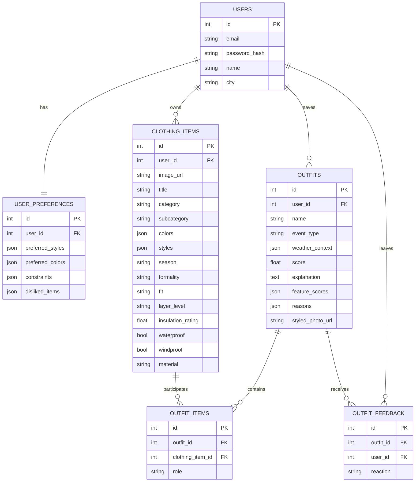

# 2.3. Проектирование базы данных

Проектирование базы данных необходимо для определения того, каким образом в разрабатываемом веб-сервисе будут храниться сведения о пользователях, карточках одежды, сохраненных образах, предпочтениях и пользовательской реакции на результаты подбора. Для проектируемой системы предполагается использовать реляционную модель данных на базе СУБД MySQL. Такой выбор обусловлен тем, что в сервисе планируется хранить структурированную информацию с фиксированным набором атрибутов, а также устойчивые связи между основными сущностями.

Реляционная модель в данном проекте является оправданной по следующим причинам:

- данные имеют выраженную структуру и описываются конечным набором полей;
- между объектами сервиса существуют стабильные связи один к одному, один ко многим и многие ко многим;
- требуется поддержка ограничений целостности, уникальности и ссылочной связанности;
- необходимо обеспечить предсказуемую работу CRUD-операций и алгоритма подбора образов;
- в дальнейшем база данных должна оставаться расширяемой при подключении внешних сервисов, в частности сервиса определения погоды.

При этом часть многозначных характеристик предполагается хранить в JSON-полях. Это позволит не усложнять схему на раннем этапе разработки и при этом сохранить возможность работы со списками цветов, стилей, ограничений и причин выбора образа.

На текущем этапе в модели данных планируется выделить следующие основные сущности:

- `Пользователь`;
- `Предпочтения пользователя`;
- `Вещь`;
- `Образ`;
- `Состав образа`;
- `Обратная связь`.

Такая структура позволит разделить учетные данные, параметры персонализации, данные цифрового гардероба, результаты подбора образов и реакцию пользователя на эти результаты.

---

## 2.3.1. Обоснование выбора модели базы данных

В разрабатываемом сервисе база данных должна поддерживать несколько основных сценариев хранения.

Во-первых, потребуется хранить учетные записи пользователей, поскольку система предполагает регистрацию, вход в личный кабинет и доступ только к собственным данным. Во-вторых, потребуется хранить карточки одежды с характеристиками, которые будут использоваться при подборе образов. В-третьих, необходимо предусмотреть хранение сохраненных пользователем образов, включая их состав, итоговую оценку и пояснение. В-четвертых, для персонализации рекомендаций потребуется хранить предпочтения пользователя. В-пятых, потребуется фиксировать пользовательскую реакцию на сохраненные образы.

Из перечисленных требований следует, что проектируемая база данных должна поддерживать:

- связь один к одному между пользователем и его предпочтениями;
- связь один ко многим между пользователем и вещами;
- связь один ко многим между пользователем и сохраненными образами;
- связь многие ко многим между образом и вещами через промежуточную сущность;
- связь между образом и пользовательской реакцией.

Для описания структуры проектируемой базы данных целесообразно использовать ER-модель. В рамках ER-представления будут выделены сущности, их атрибуты, первичные ключи, внешние ключи и типы связей. Такой подход позволит логически обосновать структуру хранилища до этапа непосредственной реализации и затем без существенных изменений перенести проектную модель в ORM-слой backend-приложения.

Следует отметить, что в проектируемой модели не планируется выделять отдельную таблицу погоды. На текущем этапе погодные параметры рассматриваются как контекст подбора образа, а не как самостоятельный объект предметной области. Поэтому сведения о погоде предполагается хранить в составе сущности `Образ` в JSON-поле `weather_context`. Такой подход упростит первоначальную реализацию. В дальнейшем, если потребуется накопление погодной истории или кэширование ответов внешнего API, схема сможет быть расширена отдельной сущностью без переработки базовых таблиц.

---

## 2.3.2. Проектирование сущностей и их атрибутов

### Сущность «Пользователь»

Сущность `Пользователь` планируется использовать для хранения учетной записи пользователя, необходимой для авторизации, идентификации владельца гардероба и привязки остальных данных системы к конкретному аккаунту.

**Таблица 2.3. Атрибуты сущности «Пользователь»**

| Название поля | Описание | Тип данных | Ограничения |
|---|---|---|---|
| `id` | уникальный идентификатор пользователя | INTEGER | PRIMARY KEY, AUTO_INCREMENT |
| `email` | адрес электронной почты пользователя | VARCHAR(255) | NOT NULL, UNIQUE |
| `password_hash` | хэш пароля пользователя | VARCHAR(255) | NOT NULL |
| `name` | имя пользователя | VARCHAR(120) | NOT NULL |
| `city` | город пользователя | VARCHAR(120) | NULL |

Проектно предполагается, что поле `email` будет использоваться как уникальный идентификатор учетной записи на уровне пользовательского ввода, а `id` — как технический первичный ключ внутри базы данных.

### Сущность «Предпочтения пользователя»

Сущность `Предпочтения пользователя` планируется выделить отдельно, чтобы не перегружать таблицу пользователей параметрами персонализации. Это также позволит гибко расширять набор настроек без изменения структуры основной учетной записи. Между пользователем и предпочтениями будет установлена связь один к одному.

**Таблица 2.4. Атрибуты сущности «Предпочтения пользователя»**

| Название поля | Описание | Тип данных | Ограничения |
|---|---|---|---|
| `id` | уникальный идентификатор записи предпочтений | INTEGER | PRIMARY KEY, AUTO_INCREMENT |
| `user_id` | ссылка на пользователя | INTEGER | FOREIGN KEY, NOT NULL, UNIQUE |
| `preferred_styles` | предпочитаемые стили одежды | JSON | NOT NULL |
| `preferred_colors` | предпочитаемые цвета | JSON | NOT NULL |
| `constraints` | ограничения при подборе образов | JSON | NOT NULL |
| `disliked_items` | нежелательные признаки или категории вещей | JSON | NOT NULL |

Несмотря на то, что содержательно эти поля могут быть пустыми, на уровне проектируемой схемы целесообразно задать их как обязательные и хранить в виде пустых JSON-массивов по умолчанию. Это упростит серверную логику и исключит неоднозначность между `NULL` и пустым списком.

### Сущность «Вещь»

Сущность `Вещь` будет использоваться для хранения элементов цифрового гардероба. Каждая вещь будет принадлежать одному пользователю, а набор её характеристик будет использоваться алгоритмом подбора образов.

При проектировании сущности необходимо учитывать, что вещь должна описываться не только общими модными признаками, но и параметрами, влияющими на подбор по погоде и температуре. Поэтому, кроме категории, цвета и стиля, в модель включаются признаки слоя, утепления и защитных свойств.

**Таблица 2.5. Атрибуты сущности «Вещь»**

| Название поля | Описание | Тип данных | Ограничения |
|---|---|---|---|
| `id` | уникальный идентификатор вещи | INTEGER | PRIMARY KEY, AUTO_INCREMENT |
| `user_id` | ссылка на владельца вещи | INTEGER | FOREIGN KEY, NOT NULL |
| `image_url` | путь или ссылка на изображение вещи | VARCHAR(255) | NULL |
| `title` | название вещи | VARCHAR(255) | NOT NULL |
| `category` | основная категория вещи | VARCHAR(50) | NOT NULL |
| `subcategory` | подкатегория вещи | VARCHAR(100) | NULL |
| `colors` | список цветов вещи | JSON | NOT NULL |
| `styles` | список стилевых характеристик | JSON | NOT NULL |
| `season` | сезон использования вещи | VARCHAR(50) | NOT NULL |
| `formality` | уровень формальности | VARCHAR(50) | NOT NULL |
| `fit` | тип посадки вещи | VARCHAR(50) | NULL |
| `layer_level` | роль вещи в системе слоев | VARCHAR(50) | NULL |
| `insulation_rating` | уровень утепления вещи | FLOAT | NOT NULL, DEFAULT 0 |
| `waterproof` | защита от дождя | BOOLEAN | NOT NULL, DEFAULT FALSE |
| `windproof` | защита от ветра | BOOLEAN | NOT NULL, DEFAULT FALSE |
| `material` | материал вещи | VARCHAR(80) | NULL |

При корректировке структуры сущности важно учитывать несколько моментов:

- поле `layer_level` целесообразно хранить как строковый атрибут, а не как INTEGER, поскольку оно описывает не числовой уровень, а роль вещи в слоистости, например `base`, `mid`, `outer`, `support`;
- параметр утепления удобнее хранить как `FLOAT`, поскольку в алгоритме подбора предполагается использование промежуточных значений;
- путь к изображению логичнее хранить в поле `image_url`, так как на уровне приложения будет использоваться как локальный, так и внешний URL;
- поле `styles` в проектируемой структуре лучше считать обязательным и при отсутствии значений инициализировать пустым массивом.

### Сущность «Образ»

Сущность `Образ` потребуется для хранения сохраненных пользователем комплектов одежды. В ней будут фиксироваться общие сведения о результате подбора, контекст, итоговая оценка, набор пояснений и, при необходимости, фотография пользователя в собранном образе.

Один пользователь сможет иметь несколько сохраненных образов, поэтому между пользователем и образами будет связь один ко многим.

**Таблица 2.6. Атрибуты сущности «Образ»**

| Название поля | Описание | Тип данных | Ограничения |
|---|---|---|---|
| `id` | уникальный идентификатор образа | INTEGER | PRIMARY KEY, AUTO_INCREMENT |
| `user_id` | ссылка на пользователя | INTEGER | FOREIGN KEY, NOT NULL |
| `name` | название сохраненного образа | VARCHAR(255) | NOT NULL |
| `event_type` | тип события, для которого сохранен образ | VARCHAR(80) | NOT NULL |
| `weather_context` | сведения о погодных условиях и температуре | JSON | NULL |
| `score` | итоговая оценка образа | FLOAT | NOT NULL, DEFAULT 0 |
| `explanation` | краткое пояснение результата | TEXT | NULL |
| `feature_scores` | оценки по отдельным признакам | JSON | NULL |
| `reasons` | список причин высокого результата | JSON | NULL |
| `styled_photo_url` | путь к фотографии пользователя в образе | VARCHAR(500) | NULL |

Для проектного описания важно отметить, что поле `weather_context` не будет содержать только температуру. В него целесообразно включать и другие параметры:

- город;
- погодное состояние;
- сезон;
- источник погодных данных.

Такое решение обеспечит готовность к последующему подключению внешнего погодного API.

### Сущность «Состав образа»

Для связи сущности `Образ` с конкретными вещами будет использоваться сущность `Состав образа`. Она необходима для реализации связи многие ко многим между образами и предметами одежды. Каждая запись будет показывать, какая вещь входит в конкретный образ и какую роль она в нем выполняет.

**Таблица 2.7. Атрибуты сущности «Состав образа»**

| Название поля | Описание | Тип данных | Ограничения |
|---|---|---|---|
| `id` | уникальный идентификатор записи состава образа | INTEGER | PRIMARY KEY, AUTO_INCREMENT |
| `outfit_id` | ссылка на образ | INTEGER | FOREIGN KEY, NOT NULL |
| `clothing_item_id` | ссылка на вещь | INTEGER | FOREIGN KEY, NOT NULL |
| `role` | роль вещи в комплекте | VARCHAR(50) | NOT NULL |

Поле `role` предполагается использовать для фиксации логической функции вещи внутри образа. Например, вещь может выступать в роли:

- верх;
- низ;
- обувь;
- верхний слой;
- аксессуар.

Это позволит отделить принадлежность вещи к категории от её конкретной роли в рамках сформированного комплекта.

### Сущность «Обратная связь»

Сущность `Обратная связь` будет использоваться для фиксации отношения пользователя к сохраненному образу. На текущем этапе предполагается хранить только тип реакции. В дальнейшем эти данные могут использоваться для уточнения логики рекомендаций и настройки весов признаков.

**Таблица 2.8. Атрибуты сущности «Обратная связь»**

| Название поля | Описание | Тип данных | Ограничения |
|---|---|---|---|
| `id` | уникальный идентификатор записи реакции | INTEGER | PRIMARY KEY, AUTO_INCREMENT |
| `outfit_id` | ссылка на образ | INTEGER | FOREIGN KEY, NOT NULL |
| `user_id` | ссылка на пользователя | INTEGER | FOREIGN KEY, NOT NULL |
| `reaction` | тип пользовательской реакции | VARCHAR(20) | NOT NULL |

Поле `created_at` в базовой проектной схеме вводить не обязательно, так как на текущем этапе реакция используется только для хранения текущего отношения пользователя к образу. Если в дальнейшем потребуется анализ динамики реакции по времени, соответствующий временной атрибут сможет быть добавлен отдельной миграцией.

---

## 2.3.3. Связи и ограничения целостности

В проектируемой модели данных предполагается использовать следующие основные связи:

- между пользователем и предпочтениями — связь один к одному;
- между пользователем и вещами — связь один ко многим;
- между пользователем и сохраненными образами — связь один ко многим;
- между образом и составом образа — связь один ко многим;
- между вещью и составом образа — связь один ко многим;
- между образом и обратной связью — связь один ко многим;
- между пользователем и обратной связью — связь один ко многим.

Содержательно связь между сущностями `Образ` и `Вещь` является связью многие ко многим, однако в физической модели она будет реализована через промежуточную таблицу `Состав образа`.

### Основные ограничения целостности

Для поддержки корректности проектируемой базы данных планируется использовать первичные ключи, внешние ключи, ограничения уникальности и каскадное удаление связанных записей.

**Таблица 2.9. Основные ограничения целостности**

| Ограничение | Реализация | Практический смысл |
|---|---|---|
| Уникальность электронной почты | `UNIQUE` для поля `email` | исключает дублирование учетных записей |
| Одна запись предпочтений на пользователя | `UNIQUE` для поля `user_id` в таблице предпочтений | у каждого пользователя хранится один набор настроек |
| Одна реакция на один образ | `UNIQUE` для пары `outfit_id` и `user_id` | исключает повторные реакции одного пользователя на один и тот же образ |
| Ссылочная целостность | `FOREIGN KEY` для полей связей | исключает появление записей без связанного пользователя, вещи или образа |
| Каскадное удаление | каскадное удаление связанных записей ORM и внешних сущностей | предотвращает появление «висячих» ссылок |

Кроме ограничений на уровне базы данных, на серверной стороне также планируется выполнять прикладную проверку прав владения:

- пользователь сможет получать доступ только к своим вещам;
- пользователь сможет сохранять только собственные комбинации вещей;
- пользователь не сможет сохранить образ, содержащий чужие элементы гардероба;
- пользователь сможет просматривать и изменять только свои сохраненные образы.

---

## 2.3.4. ER-диаграмма проектируемой базы данных

Проектируемую базу данных целесообразно представить в виде ER-диаграммы. Ниже приведен вариант диаграммы, который соответствует выбранной модели сущностей и связей.

### Пояснение к построению ER-диаграммы

При самостоятельном построении ER-диаграммы для дипломной работы рекомендуется соблюдать следующую последовательность:

1. В центре модели выделить сущность `Пользователь`, так как через неё определяется принадлежность всех остальных данных.
2. От сущности `Пользователь` провести:
   - связь `1:1` к сущности `Предпочтения пользователя`;
   - связь `1:N` к сущности `Вещь`;
   - связь `1:N` к сущности `Образ`;
   - связь `1:N` к сущности `Обратная связь`.
3. Между сущностями `Образ` и `Вещь` не проводить прямую связь, а использовать промежуточную сущность `Состав образа`.
4. Для сущности `Состав образа` указать два внешних ключа:
   - `outfit_id`;
   - `clothing_item_id`.
5. Для сущности `Обратная связь` показать, что она связывает пользователя и образ.
6. Отдельно подписать ограничения:
   - `email` уникален;
   - `user_id` в предпочтениях уникален;
   - пара `outfit_id + user_id` в обратной связи уникальна.

В графическом редакторе для диплома рекомендуется:

- первичные ключи выделять подчеркиванием или отдельной пометкой `PK`;
- внешние ключи помечать как `FK`;
- связи типа `1:1`, `1:N` и `M:N` подписывать явно;
- промежуточную сущность `Состав образа` располагать между `Образом` и `Вещью`.

---

## 2.3.5. Вывод по проектированию базы данных

Таким образом, в проектируемом веб-сервисе планируется использовать реляционную базу данных, структура которой будет включать шесть основных сущностей: пользователя, предпочтения пользователя, вещь, образ, состав образа и обратную связь. Выбранная модель позволит хранить как базовые учетные данные, так и данные цифрового гардероба, результаты подбора и персонализацию.

Предлагаемая схема обеспечивает:

- структурированное хранение информации;
- поддержку пользовательских сценариев сервиса;
- корректную реализацию связей между сущностями;
- контроль целостности данных;
- возможность поэтапного расширения проекта.

Особенно важно, что предложенная модель уже предусматривает хранение погодного контекста в составе образа, что создаёт основу для дальнейшего подключения внешнего сервиса определения погоды по текущему местоположению пользователя. При необходимости такая схема сможет быть расширена без переработки базовых сущностей цифрового гардероба и модуля подбора образов.
