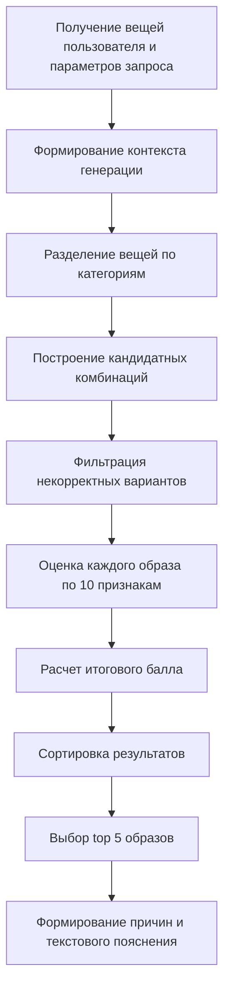

# 2.4. Моделирование алгоритма подбора образов

Проектирование алгоритма подбора образов является центральной частью разрабатываемого веб-сервиса, поскольку именно данный модуль должен обеспечивать переход от набора разрозненных вещей пользователя к нескольким осмысленным вариантам готового комплекта. В рамках проекта не планируется использовать большие языковые модели, методы компьютерного зрения или непрозрачные рекомендательные модели. Вместо этого предполагается реализовать интерпретируемый rule-based алгоритм, основанный на наборе признаков и системе весов.

Выбор такого подхода обусловлен несколькими причинами. Во-первых, он позволяет явно задать правила сочетаемости вещей и контролировать качество выдаваемых рекомендаций. Во-вторых, такой алгоритм проще описать, проверить и доработать в рамках дипломного проекта. В-третьих, он обеспечивает объяснимость результата: система сможет не только выбрать образ, но и показать пользователю, по каким причинам данный вариант оказался удачным.

Предполагается, что модуль подбора образов будет выделен в отдельный backend-компонент `recommendation_engine`, который станет получать данные о вещах пользователя, параметрах запроса и погодном контексте, после чего формировать, оценивать и ранжировать набор возможных комплектов.

## 2.4.1. Постановка задачи подбора образов

Задача подбора образов в проектируемом сервисе может быть сформулирована следующим образом: по заданному гардеробу пользователя и контексту запроса требуется выбрать несколько наиболее подходящих комплектов одежды, оценить их по набору признаков и вернуть ограниченный список лучших результатов вместе с текстовым пояснением.

На вход алгоритма планируется подавать:

- множество вещей, принадлежащих текущему пользователю;
- тип события;
- предпочтительные цвета;
- предпочтительный стиль;
- температуру воздуха;
- погодное состояние;
- ограничения пользователя;
- при необходимости идентификатор опорной вещи.

На выходе алгоритм должен возвращать не один вариант, а несколько лучших решений, так как в пользовательском сценарии важнее предоставить человеку выбор между несколькими качественными комплектами. В проектируемой версии сервиса целесообразно ограничить выдачу пятью лучшими образами.

## 2.4.2. Входные данные и контекст генерации

Для унификации работы алгоритма планируется использовать единый объект контекста генерации. В нем будут объединяться данные, поступившие из пользовательской формы, сведения из профиля пользователя и погодные параметры.

**Таблица 2.10. Основные параметры контекста генерации**

| Параметр | Назначение |
|---|---|
| `event_type` | тип события, для которого требуется сформировать образ |
| `preferred_colors` | желаемые цвета комплекта |
| `preferred_style` | предпочтительное стилевое направление |
| `temperature` | температура воздуха |
| `weather_condition` | состояние погоды: ясно, облачно, дождь, снег и др. |
| `anchor_item_id` | идентификатор опорной вещи, если пользователь хочет собрать образ вокруг нее |
| `constraints` | список ограничений, например запрет каблуков или ярких цветов |
| `season` | сезонный контекст, который может быть задан явно или выведен из температуры |
| `city` | город пользователя или текущее местоположение |

На этапе проектирования предполагается, что часть погодных данных будет передаваться пользователем вручную, а часть сможет подставляться автоматически. Для первого этапа разработки допустимо использовать упрощенную заглушку погодного сервиса. В дальнейшем планируется подключение внешнего API определения погоды по текущему местоположению пользователя. В этом случае значения температуры, погодного состояния и сезона будут автоматически включаться в контекст подбора.

## 2.4.3. Проектирование этапов алгоритма

Работу алгоритма целесообразно организовать как последовательность независимых этапов. Такое разбиение упростит проверку логики и позволит дорабатывать отдельные части модуля без переписывания всей системы.

Предполагается, что общий поток работы алгоритма будет выглядеть следующим образом:

На первом шаге вещи пользователя планируется разделять по ролям: верх, низ, обувь, верхняя одежда и аксессуары. Далее из этих пулов будут строиться кандидатные комбинации. Базовым вариантом будет считаться комплект вида:

- верх + низ + обувь;
- верх + низ + обувь + верхняя одежда;
- при наличии подходящего аксессуара он также может быть включен в образ как дополнительный элемент.

Если пользователь задаст опорную вещь, алгоритм должен будет учитывать ее как обязательный элемент одного из комплектов. Такой подход позволит формировать образ вокруг уже выбранного предмета гардероба.

После построения кандидатных комбинаций предполагается запуск фильтрации. На данном этапе будут отсекаться варианты:

- без обязательных категорий;
- с повторным использованием одной и той же вещи;
- не соответствующие событию по жестким правилам;
- нарушающие ограничения пользователя;
- заведомо неподходящие по обуви или верхней одежде для погоды и температуры.

Такое отсечение необходимо, чтобы не передавать в оценочную часть комбинации, которые уже на базовом уровне противоречат логике подбора.

## 2.4.4. Система оценочных признаков

После фильтрации каждый допустимый кандидатный образ планируется оценивать по десяти признакам. Каждый признак будет принимать значение в диапазоне от 0 до 1, где 0 означает полное несоответствие критерию, а 1 — максимально удачное соответствие.

**Таблица 2.11. Оценочные признаки алгоритма подбора**

| Признак | Назначение |
|---|---|
| `color_harmony` | оценка цветовой согласованности образа |
| `style_match` | оценка стилевой совместимости вещей |
| `event_match` | соответствие образа выбранному событию |
| `season_match` | соответствие набора вещей сезонному контексту |
| `temperature_match` | соответствие комплекта заданной температуре |
| `weather_condition_match` | соответствие дождю, снегу, ветру или ясной погоде |
| `completeness` | полнота комплекта по обязательным ролям |
| `layering_correctness` | корректность слоев и логика сочетания элементов |
| `user_preference_match` | учет предпочтительных цветов и стилей пользователя |
| `constraints_match` | соблюдение ограничений и запретов |

При проектировании алгоритма предполагается использовать следующую логику признаков.

Признак `color_harmony` должен оценивать согласованность цветовой палитры. Для этого планируется привести цветовые значения к укрупненным семействам, выделить нейтральные цвета, а затем оценивать образ по типовым цветовым схемам: нейтральная база, монохромная схема, близкие цвета и аккуратный контрастный акцент. При этом обувь и аксессуары целесообразно оценивать мягче, чем верх и низ, так как они могут выполнять роль дополнительного акцента.

Признак `style_match` должен показывать, насколько вещи сочетаются по стилевому направлению. Для этого предполагается выделить несколько стилевых семейств, например минималистичное, классическое, повседневное, спортивное и вечернее, после чего оценивать согласованность образа на уровне этих семейств.

Признак `event_match` должен отвечать за соответствие образа сценарию использования. Например, для офисного события планируется повышать оценку комплектам с более сдержанными вещами, а для спортивного — комплектам с уместной спортивной обувью и повседневными вещами.

Признаки `season_match`, `temperature_match` и `weather_condition_match` должны вместе отвечать за климатическую уместность комплекта. В частности, предполагается учитывать:

- сезон вещи;
- степень утепления;
- наличие верхней одежды;
- тип обуви;
- защиту от дождя и ветра.

Такой набор позволит избежать ситуаций, когда эстетически удачный образ оказывается непригодным для реальных погодных условий.

Признак `completeness` должен проверять полноту комплекта. Признак `layering_correctness` — логичность многослойности и отсутствие конфликтов между базовым, промежуточным и верхним слоем. Признаки `user_preference_match` и `constraints_match` будут использоваться для персонализации результата.

## 2.4.5. Весовая модель и расчет итоговой оценки

Так как значимость признаков различается, итоговую оценку образа планируется рассчитывать не как простое среднее, а как взвешенную сумму. Базовые веса целесообразно задать заранее в конфигурации алгоритма.

**Таблица 2.12. Базовые веса оценочных признаков**

| Признак | Базовый вес |
|---|---:|
| `color_harmony` | 0,15 |
| `style_match` | 0,15 |
| `event_match` | 0,15 |
| `season_match` | 0,10 |
| `temperature_match` | 0,10 |
| `weather_condition_match` | 0,10 |
| `layering_correctness` | 0,08 |
| `completeness` | 0,06 |
| `user_preference_match` | 0,06 |
| `constraints_match` | 0,05 |

Тогда итоговый балл образа можно задать формулой:

\[
S = \sum_{i=1}^{10} w_i \cdot f_i
\]

где:

- \(S\) — итоговый балл образа;
- \(w_i\) — вес признака;
- \(f_i\) — значение признака в диапазоне от 0 до 1.

Дополнительно в проектируемой модели предполагается использовать контекстную перенастройку весов. Например, при низкой температуре или неблагоприятной погоде больший вес будут получать погодные и температурные признаки, а при деловых и вечерних событиях больший вклад смогут вносить соответствие событию, стилевая согласованность и цветовая гармония.

Такой подход позволит сделать итоговую оценку более чувствительной к реальному сценарию использования образа.

## 2.4.6. Формирование итогового результата и пояснения

После вычисления итогового балла все допустимые кандидаты планируется отсортировать по убыванию оценки. Пользователю будут возвращаться только несколько лучших вариантов, например top 5 образов.

Для каждого результата предполагается формировать:

- состав образа;
- итоговый балл;
- оценки по признакам;
- короткий список причин;
- связное текстовое пояснение.

Механизм объяснения также целесообразно построить на rule-based основе. Для этого можно выбрать 2–4 признака с наибольшим вкладом и сопоставить им шаблонные формулировки. Например:

- образ подходит для выбранного события;
- комплект соответствует погодным условиям;
- цвета вещей хорошо сочетаются;
- учтены предпочтения пользователя.

Такой подход позволит сохранить объяснимость и сделать рекомендации более понятными для пользователя.

## 2.4.7. Обработка граничных случаев

На этапе проектирования необходимо предусмотреть устойчивую работу алгоритма в случаях, когда входные данные неполны или содержат ограничения.

**Таблица 2.13. Основные граничные случаи**

| Ситуация | Планируемая реакция системы |
|---|---|
| у пользователя недостаточно вещей | возврат пустого списка образов и поясняющего сообщения |
| отсутствует обязательная категория | комбинации не формируются |
| опорная вещь не принадлежит пользователю | генерация не выполняется |
| часть вещей не имеет цветов или стилей | применяются более мягкие правила оценки |
| неизвестные названия цветов | значения переводятся в категорию `unknown` без аварийного завершения |
| невозможно собрать допустимый комплект | возвращается пустой результат без ошибки сервера |

Такой подход важен для практической устойчивости сервиса, так как пользовательский гардероб может быть заполнен неполно, а характеристики вещей — заданы неидеально.

## 2.4.8. Перспективы развития алгоритма

Спроектированная модель алгоритма должна оставаться расширяемой. В дальнейшем предполагается развитие по следующим направлениям:

- подключение внешнего погодного API для автоматического определения текущих условий;
- расширение набора признаков за счет учета принтов, фактур и контраста;
- использование пользовательской обратной связи для уточнения весов;
- расширение системы объяснимости;
- введение более подробных правил для различных дресс-кодов.

Таким образом, проектируемый алгоритм подбора образов должен представлять собой прозрачную и расширяемую основу, которая уже на первом этапе позволит формировать несколько контекстно уместных комплектов одежды на основе цифрового гардероба пользователя.
