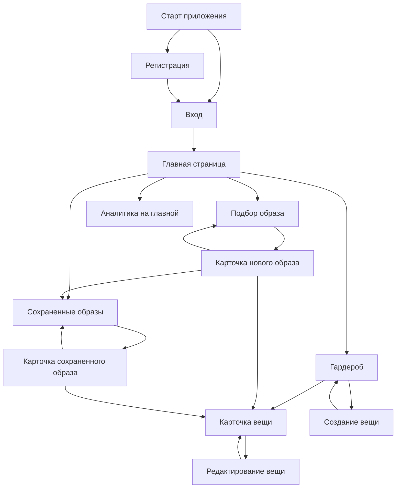
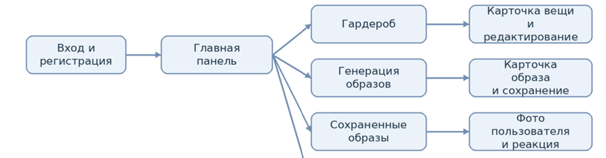
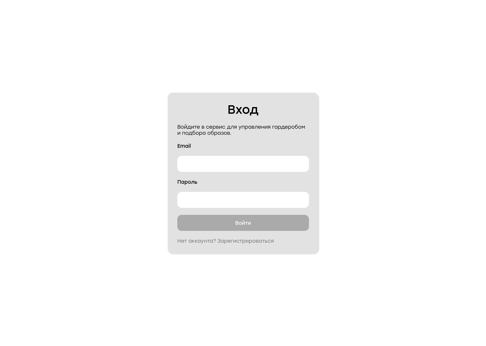
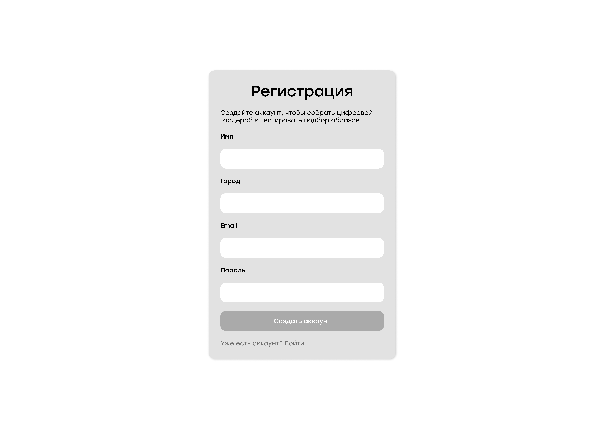
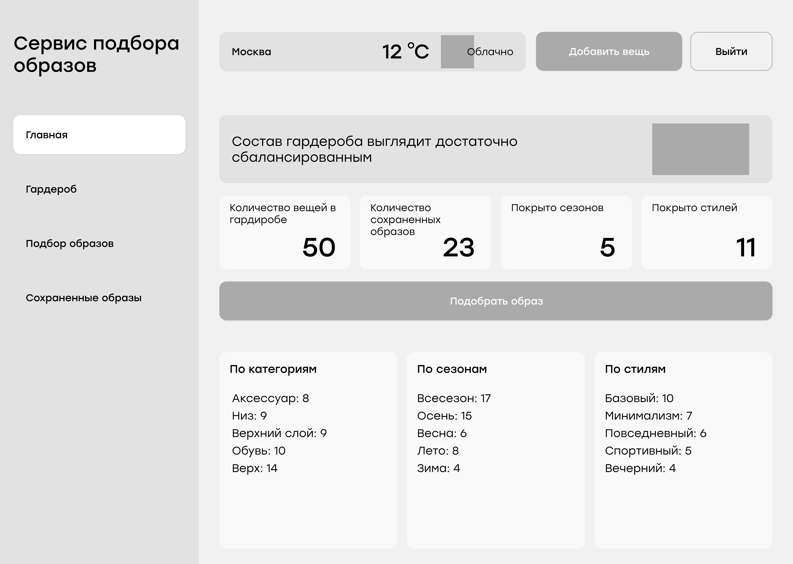
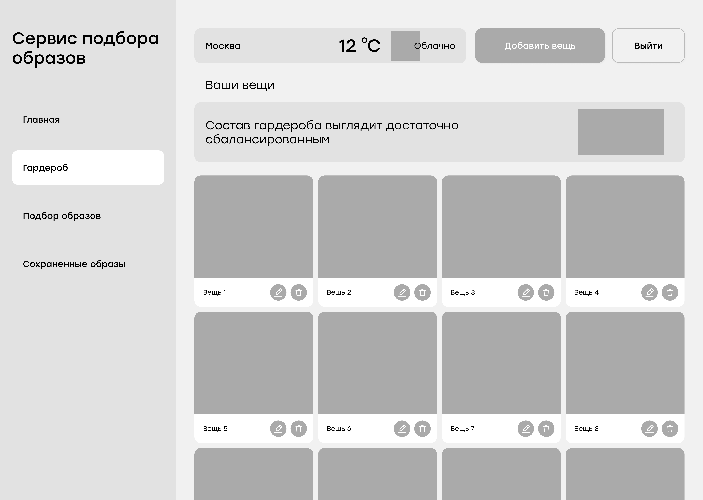
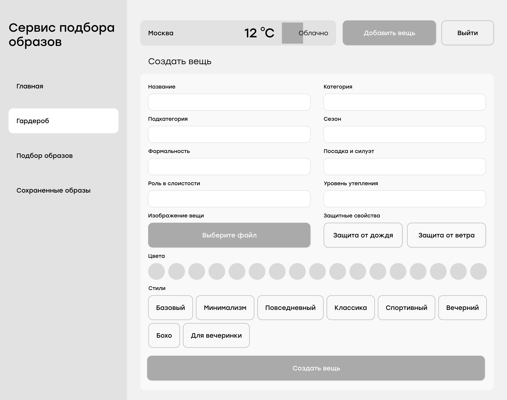
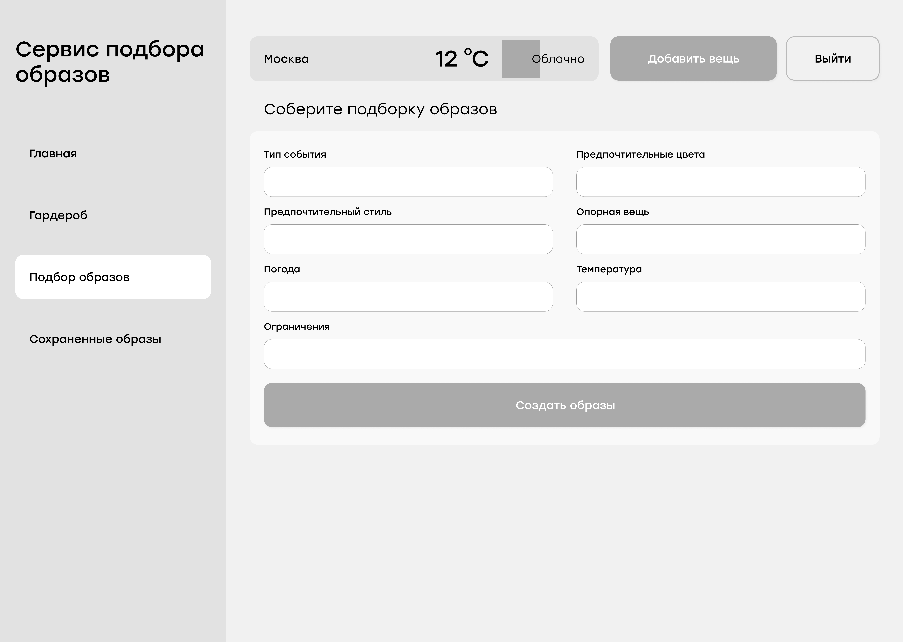
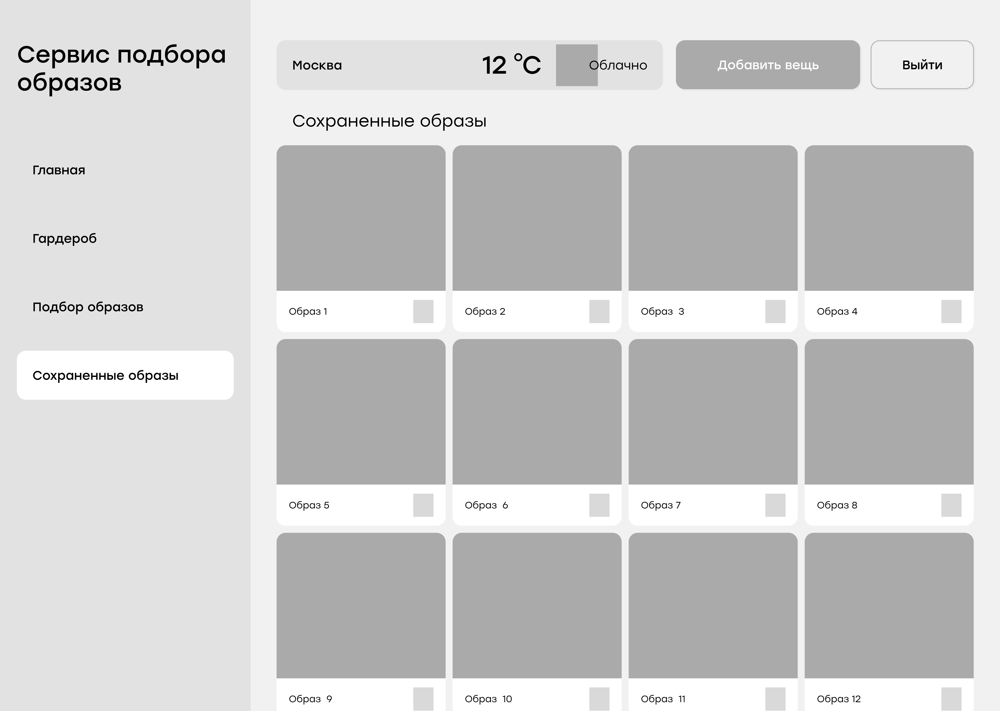

# 2.5. Проектирование пользовательского интерфейса

Проектирование пользовательского интерфейса требуется для того, чтобы определить структуру экранов веб-сервиса, порядок переходов между ними и способ представления основных функций пользователю. Для сервиса подбора образов интерфейс имеет особое значение, так как пользователь работает с визуальными объектами: фотографиями вещей, карточками гардероба, досками образов и сохраненными комплектами.

На этапе проектирования предполагается создать интерфейс, который будет поддерживать основные сценарии: регистрацию и вход, просмотр главной страницы, управление цифровым гардеробом, добавление и редактирование вещи, подбор образа, сохранение результата и просмотр сохраненных комплектов. Аналитические сведения о гардеробе планируется размещать на главной странице, поэтому отдельная вкладка аналитики в итоговой навигации не предусматривается.

## 2.5.1. Проектирование навигации пользователя

Навигация пользователя должна быть построена так, чтобы основные действия были доступны из личного кабинета без большого числа вложенных переходов. После авторизации пользователь должен попадать на главную страницу. С нее планируется организовать переходы к гардеробу, генерации образов и сохраненным комплектам.

Основная навигационная схема проектируемого интерфейса представлена ниже.

**Рисунок 2.5. Схема навигации пользовательского интерфейса**

В навигации планируется выделить несколько ключевых разделов. Страницы входа и регистрации будут доступны неавторизованному пользователю. После входа основным экраном станет главная страница. Раздел гардероба будет вести к списку вещей, карточке конкретной вещи и форме создания или изменения записи. Раздел подбора образа будет использоваться для ввода параметров генерации и просмотра результата. Раздел сохраненных образов позволит вернуться к выбранным комплектам и открыть карточку сохраненного образа.

## 2.5.2. Страница входа

Страница входа предназначена для авторизации пользователя. На ней планируется разместить форму с двумя основными полями: адрес электронной почты и пароль. После успешного входа пользователь будет перенаправляться на главную страницу личного кабинета.

Если учетной записи еще нет, на странице входа должен быть предусмотрен переход к регистрации. Такой сценарий позволит пользователю быстро выбрать нужное действие без поиска дополнительного меню.

**Рисунок 2.6. Прототип страницы входа**

## 2.5.3. Страница регистрации

Страница регистрации должна использоваться для создания учетной записи. В форму планируется включить имя пользователя, город, email и пароль. Поле города важно предусмотреть уже на этапе проектирования, так как в дальнейшем оно может использоваться при подключении внешнего погодного сервиса.

После успешной регистрации пользователь должен получить доступ к личному кабинету. При наличии учетной записи пользователь сможет перейти обратно на страницу входа.

**Рисунок 2.7. Прототип страницы регистрации**

## 2.5.4. Главная страница с аналитикой

Главная страница будет выполнять роль стартовой панели пользователя. На ней планируется разместить приветственный блок, краткую информацию о гардеробе, быстрые переходы к основным разделам и аналитические показатели.

Так как отдельная вкладка аналитики в дальнейшем не планируется, основные аналитические данные целесообразно вынести именно на главную страницу. В этом блоке пользователь сможет увидеть общее количество вещей, распределение по категориям, сезонам и стилям, а также короткие рекомендации по наполнению гардероба.

С главной страницы пользователь должен переходить к следующим действиям:

- открыть гардероб;
- добавить новую вещь;
- перейти к подбору образа;
- открыть сохраненные образы.

**Рисунок 2.8. Прототип главной страницы с аналитикой**

## 2.5.5. Страница гардероба

Страница гардероба предназначена для просмотра всех вещей пользователя. Основной элемент экрана — сетка карточек. Каждая карточка должна содержать фотографию вещи, название и две иконки действий: редактирование и удаление.

Полные характеристики вещи не планируется показывать прямо в списке, чтобы не перегружать страницу. При нажатии на карточку пользователь должен переходить на отдельную страницу вещи. Такой подход позволяет сохранить список компактным и при этом оставить доступ к подробной информации.

Со страницы гардероба пользователь сможет:

- открыть карточку вещи;
- перейти к созданию новой вещи;
- перейти к редактированию выбранной вещи;
- удалить вещь из гардероба.

**Рисунок 2.9. Прототип страницы гардероба**

## 2.5.6. Страница карточки вещи

Карточка вещи должна показывать полную информацию о выбранном предмете гардероба. В первой колонке планируется разместить изображение вещи. Во второй колонке — название, категорию, подкатегорию, сезон, цвета, стили, формальность, посадку, слой, утепление и погодные признаки.

Кнопки действий целесообразно оформить как компактные иконки. Они должны располагаться в нижней части информационной колонки. Это позволит отделить основные сведения от действий редактирования и удаления.

Эта страница должна открываться из гардероба и из карточки образа. Такой переход важен, потому что пользователь может увидеть вещь в составе образа и сразу перейти к ее описанию.

**Рисунок 2.10. Прототип карточки вещи**

## 2.5.7. Страница создания и редактирования вещи

Форма создания и редактирования вещи должна обеспечивать контролируемый ввод характеристик. Для большинства полей планируется использовать выпадающие списки, переключатели и множественный выбор. Цвета целесообразно показывать в виде цветных кружков, чтобы пользователь выбирал их визуально.

Такой подход нужен для однородности данных. Если пользователь будет вводить характеристики произвольным текстом, алгоритму подбора будет сложнее сравнивать вещи между собой. Поэтому интерфейс формы должен направлять пользователя к выбору из заранее подготовленных значений.

В форме планируется предусмотреть:

- загрузку изображения;
- название вещи;
- категорию и подкатегорию;
- цвета;
- стили;
- сезон;
- формальность;
- посадку;
- уровень слоя;
- утепление;
- признаки защиты от дождя и ветра.

После сохранения пользователь должен возвращаться к карточке вещи или в гардероб.

**Рисунок 2.11. Прототип формы создания и редактирования вещи**

## 2.5.8. Страница подбора образов

Страница подбора образов должна использоваться для задания параметров генерации. Пользователь сможет выбрать тип события, предпочтительный стиль, желаемые цвета, погодные условия, температуру, ограничения и, при необходимости, опорную вещь.

После запуска подбора система должна показать пользователю результаты в визуальном формате. Вместо обычного списка планируется использовать карточку-доску образа. На такой доске вещи будут представлены как отдельные изображения, а рядом или в отдельном блоке будет отображаться оценка и краткое пояснение.

Пользователь сможет перелистывать предложенные варианты, сохранять понравившийся образ и переходить к карточкам отдельных вещей. Такая логика делает результат подбора более наглядным и ближе к формату стилистической подборки.

**Рисунок 2.12. Прототип страницы подбора образов**

## 2.5.9. Карточка нового образа

Карточка нового образа должна открываться как отдельное визуальное окно поверх страницы подбора. В ней планируется разместить доску с вещами, итоговую оценку, краткое пояснение и причины выбора.

На доске элементы одежды должны располагаться равномерно и не перекрывать друг друга. Для удобства восприятия планируется использовать фиксированные зоны: верх, низ, обувь, верхняя одежда и аксессуары. Если один из дополнительных элементов отсутствует, оставшиеся карточки должны выравниваться компактно.

В карточке также должны быть предусмотрены действия:

- перейти к предыдущему или следующему варианту;
- сохранить образ;
- закрыть карточку;
- открыть страницу конкретной вещи.

**Рисунок 2.13. Прототип карточки нового образа**

## 2.5.10. Страница сохраненных образов

Страница сохраненных образов предназначена для повторного просмотра комплектов, которые пользователь отметил как удачные. Она должна содержать список сохраненных карточек и давать возможность открыть каждый образ подробнее.

На этой странице пользователь сможет вернуться к ранее выбранному комплекту, оценить его состав и при необходимости перейти к вещам, входящим в образ. Такой раздел нужен для того, чтобы результат подбора не исчезал после закрытия страницы генерации.

**Рисунок 2.14. Прототип страницы сохраненных образов**

## 2.5.11. Карточка сохраненного образа

Карточка сохраненного образа будет похожа на карточку нового результата, но должна дополнительно поддерживать загрузку фотографии пользователя в выбранном комплекте. После сохранения образа пользователь сможет прикрепить свое фото, чтобы получить более персонализированную карточку.

В карточке планируется показывать:

- визуальную доску с элементами образа;
- итоговую оценку;
- краткое пояснение;
- причины выбора;
- загруженное фото пользователя, если оно добавлено.

**Рисунок 2.15. Прототип карточки сохраненного образа**

## 2.5.12. Обобщение проектируемых экранов

Ниже приведена сводная таблица основных экранов интерфейса и их назначения.

**Таблица 2.14. Основные экраны пользовательского интерфейса**

| Экран | Назначение | Основной переход |
|---|---|---|
| Вход | авторизация пользователя | главная страница |
| Регистрация | создание учетной записи | вход или главная страница |
| Главная страница | навигация и аналитика гардероба | гардероб, подбор, сохраненные образы |
| Гардероб | просмотр вещей пользователя | карточка вещи, создание вещи |
| Карточка вещи | просмотр характеристик предмета | редактирование вещи, возврат в гардероб |
| Создание/редактирование вещи | заполнение характеристик предмета | карточка вещи или гардероб |
| Подбор образов | ввод параметров генерации | карточка нового образа |
| Карточка нового образа | просмотр результата подбора | сохранение, переход к вещи |
| Сохраненные образы | просмотр сохраненных комплектов | карточка сохраненного образа |
| Карточка сохраненного образа | повторный просмотр образа и добавление фото | сохраненные образы, карточка вещи |

## Вывод по проектированию интерфейса

В результате проектирования пользовательского интерфейса была определена структура экранов веб-сервиса и логика переходов между ними. Основу интерфейса составляют главная страница с аналитикой, цифровой гардероб, форма создания вещи, модуль подбора образов и раздел сохраненных комплектов.

Принятое решение с размещением аналитики на главной странице должно сократить число разделов и сделать стартовый экран более полезным. Использование карточек вещей, визуальных досок образов и контролируемых форм ввода позволит связать удобство интерфейса с требованиями алгоритма подбора. Такой подход должен обеспечить пользователю понятный путь от заполнения гардероба до получения и сохранения рекомендованного образа.
